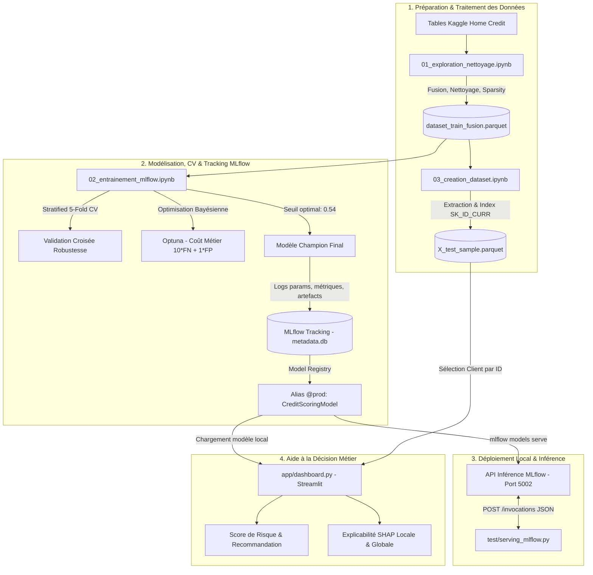

# Prêt à dépenser — Scoring Crédit & Plateforme MLOps

<p align="center">
  
  
  
  
  
  
  
</p>

Ce projet met en place une chaîne MLOps de bout en bout pour la société financière « Prêt à dépenser ». L'outil prédit le risque de défaut de paiement d'un emprunteur, minimise une fonction de coût métier dissymétrique, assure la traçabilité complète des expérimentations dans MLflow et offre une interface d'aide à la décision explicable (SHAP) pour les chargés d'études.

---

## 🏗️ Architecture du Système



---

## 📁 Structure du Projet

```text
5_MLOps_Part2/
├── data/
│   ├── raw/                         # Données brutes Kaggle (application_train, bureau...)
│   ├── processed/                   # Datasets nettoyés et échantillon de test
│   │   ├── dataset_train_fusion.parquet
│   │   └── X_test_sample.parquet    # Échantillon 50 clients indexés par SK_ID_CURR
│   └── mlflow/                      # Persistance MLflow locale (metadata.db & mlruns/)
├── notebooks/
│   ├── 01_exploration_nettoyage.ipynb  # EDA, encodage mixte, gestion des NaN et anomalies
│   ├── 02_entrainement_mlflow.ipynb    # Modélisation, 5-Fold CV, Optuna, seuil et logs
│   └── 03_creation_dataset.ipynb       # Génération de l'échantillon de test
├── app/
│   └── dashboard.py                 # Interface Streamlit d'aide à la décision et SHAP
├── test/
│   └── serving_mlflow.py            # Script d'appel HTTP sur l'endpoint /invocations
├── pyproject.toml                   # Spécification des dépendances et de l'environnement
└── README.md
```

---

## ⚙️ Installation & Prérequis

Le projet s'exécute avec Python 3.11 et utilise le gestionnaire d'environnement `uv`.

### 1. Cloner le projet et installer les dépendances

```bash
# Cloner le dépôt
git clone <URL_DU_DEPOT>
cd 5_MLOps_Part2

# Installer et synchroniser l'environnement virtuel avec uv
uv sync
```

### 2. Exécution du pipeline de données et de modélisation

Exécutez séquentiellement les notebooks dans Jupyter :

- **`notebooks/01_exploration_nettoyage.ipynb`** : ingestion, fusion et traitement des valeurs manquantes et aberrantes.
- **`notebooks/02_entrainement_mlflow.ipynb`** : validation croisée stratifiée, optimisation des hyperparamètres (Optuna), optimisation du seuil et enregistrement du champion.
- **`notebooks/03_creation_dataset.ipynb`** : création de `X_test_sample.parquet` pour l'inférence.

---

## 🚀 Déploiement Local & Utilisation

Le projet comporte trois points d'accès opérationnels.

### 1. Interface Web MLflow (Visualisation du Tracking)

Pour visualiser les runs, comparer les courbes d'apprentissage et vérifier le registre de modèles :

```bash
uv run mlflow ui --backend-store-uri sqlite:///data/mlflow/metadata.db --port 5000
```

Accès : [http://127.0.0.1:5000](http://127.0.0.1:5000)

### 2. Déploiement de l'API de Serving MLflow

MLflow sert directement le modèle champion enregistré sous l'alias `prod` :

```bash
# Lancement du serveur d'inférence sur le port 5002
uv run mlflow models serve -m "models:/CreditScoringModel@prod" -p 5002 --no-conda
```

Pour tester l'endpoint d'inférence `/invocations`, exécutez dans un autre terminal :

```bash
uv run python test/serving_mlflow.py
```

### 3. Tableau de Bord d'Aide à la Décision (Streamlit)

Pour démarrer l'application interactive destinée au chargé d'études :

```bash
uv run streamlit run app/dashboard.py
```

Accès : [http://localhost:8501](http://localhost:8501)

**Fonctionnalités de l'interface :**

- **Saisie client** : sélection par identifiant bancaire réel (`SK_ID_CURR`).
- **Décision automatisée** : calcul de probabilité et arbitrage selon le seuil métier optimal (0,54).
- **Interprétabilité locale (SHAP)** : graphique en cascade (waterfall) explicitant les contributions positives et négatives des variables pour le client sélectionné.
- **Interprétabilité globale** : classement des 20 variables les plus influentes sur les décisions du modèle.