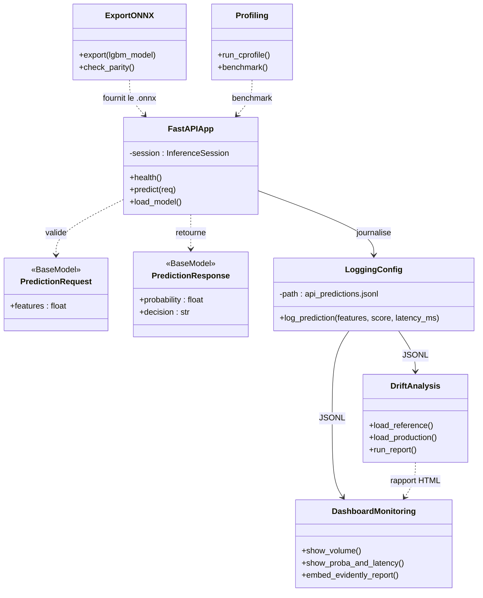
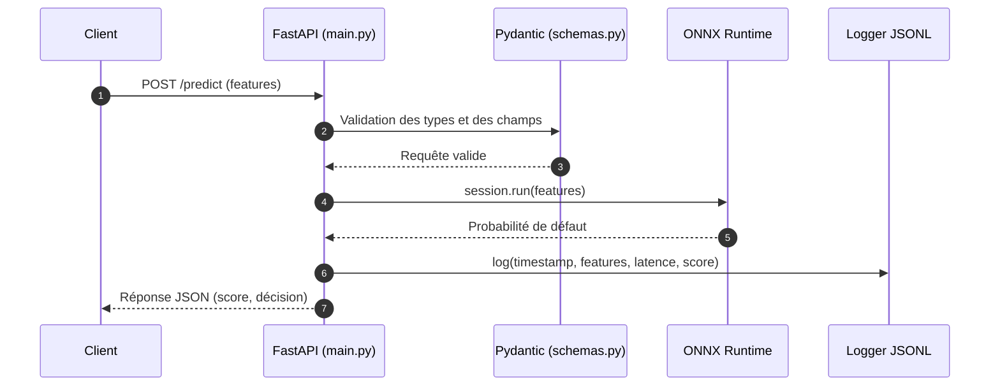

<p align="center">
  
</p>

<p align="center">
  
  
  
  
  
  
  
  
  
  
  
  
</p>

# 🛡️ Prêt à Dépenser — API de Scoring Crédit & Monitoring (Partie 2)

Ce dépôt contient l'infrastructure de **mise en production**, de **conteneurisation**, de **monitoring** et d'**optimisation** du modèle de scoring de crédit pour le département « Crédit Express ».

---

## 📑 Sommaire

- [Architecture du projet](#️-architecture-du-projet)
- [Diagrammes UML](#-diagrammes-uml)
- [Installation & lancement rapide](#-installation--lancement-rapide)
- [Déploiement conteneurisé (Docker)](#-déploiement-conteneurisé-docker)
- [Monitoring & détection de Data Drift](#-monitoring--détection-de-data-drift)
- [Profilage & optimisation (ONNX Runtime)](#-profilage--optimisation-onnx-runtime)
- [CI/CD](#-cicd)

---

## 🏗️ Architecture du projet

```text
5_MLOps_Part2/
├── .github/workflows/
│   └── ci_cd.yml                 # Pipeline GitHub Actions (Tests unitaires + Build Docker)
├── api/
│   ├── main.py                   # API FastAPI (chargement unique, moteur ONNX)
│   ├── schemas.py                # Schémas Pydantic (validation des inputs et types)
│   └── logging_config.py         # Module de logging structuré JSONL
├── app/
│   ├── streamlit.py              # Module streamlit
├── data/
│   ├── mlflow/                   # Métadonnées SQLite et artefacts MLflow
│   ├── processed/                # Datasets de référence
│   └── production/               # Logs d'inférence temps réel (api_predictions.jsonl)
│   └── raw/                      # Donnée brut
├── docs/
│   ├── architecture.svg          # Schéma d'architecture MLOps
│   └── uml_classes.svg           # Diagramme UML des modules
├── monitoring/
│   ├── drift_analysis.py         # Script d'analyse du Data Drift (Evidently AI)
│   ├── dashboard_monitoring.py   # Dashboard Streamlit de suivi des métriques
│   └── reports/                  # Rapport HTML Evidently généré
├── notebooks/
│   ├── 01_exploration_nettoyage.ipynb  # EDA, encodage mixte, gestion des NaN et anomalies
│   ├── 02_entrainement_mlflow.ipynb    # Modélisation, 5-Fold CV, Optuna, seuil et logs
│   └── 03_creation_dataset.ipynb       # Génération de l'échantillon de test
├── optimization/
│   ├── export_onnx.py            # Script d'export LightGBM -> ONNX
│   ├── profiling.py              # Script de profilage cProfile et benchmark
│   ├── credit_scoring_model.onnx # Modèle sérialisé ONNX
│   └── optimization_report.txt   # Résultats comparatifs de latence
├── test/
│   └── serving_mlflow.py         # Script d'appel HTTP sur l'endpoint /invocations
│   └── simulate_traffic.py       # Client de test : envoie 10 clients réels à /predict
│   └── test_api.py               # Tests unitaires Pytest (7 tests de robustesse)
├── Dockerfile                    # Conteneurisation de l'API
├── docker-compose.yml            # Déploiement local orchestré
└── pyproject.toml                # Gestion des dépendances uv
```

### Vue d'ensemble

<p align="center">
  
</p>

---

## 🧩 Diagrammes UML

### Diagramme de classes / modules

<p align="center">
  
</p>

Version Mermaid (rendue nativement par GitHub) :


```mermaid
classDiagram
    class PredictionRequest {
        <<BaseModel>>
        +features : float
    }
    class PredictionResponse {
        <<BaseModel>>
        +probability : float
        +decision : str
    }
    class FastAPIApp {
        -session : InferenceSession
        +health()
        +predict(req)
        +load_model()
    }
    class LoggingConfig {
        -path : api_predictions.jsonl
        +log_prediction(features, score, latency_ms)
    }
    class ExportONNX {
        +export(lgbm_model)
        +check_parity()
    }
    class Profiling {
        +run_cprofile()
        +benchmark()
    }
    class DriftAnalysis {
        +load_reference()
        +load_production()
        +run_report()
    }
    class DashboardMonitoring {
        +show_volume()
        +show_proba_and_latency()
        +embed_evidently_report()
    }

    FastAPIApp ..> PredictionRequest : valide
    FastAPIApp ..> PredictionResponse : retourne
    FastAPIApp --> LoggingConfig : journalise
    ExportONNX ..> FastAPIApp : fournit le .onnx
    Profiling ..> FastAPIApp : benchmark
    LoggingConfig --> DriftAnalysis : JSONL
    LoggingConfig --> DashboardMonitoring : JSONL
    DriftAnalysis ..> DashboardMonitoring : rapport HTML
```

### Diagramme de séquence — appel à `/predict`


```mermaid
sequenceDiagram
    autonumber
    participant C as Client
    participant A as FastAPI (main.py)
    participant S as Pydantic (schemas.py)
    participant O as ONNX Runtime
    participant L as Logger JSONL

    C->>A: POST /predict (features)
    A->>S: Validation des types et des champs
    S-->>A: Requête valide
    A->>O: session.run(features)
    O-->>A: Probabilité de défaut
    A->>L: log(timestamp, features, latence, score)
    A-->>C: Réponse JSON (score, décision)
```

---

## 🚀 Installation & lancement rapide

### 1. Installation de l'environnement

Le projet est géré avec `uv` sous Python 3.11 :

```bash
uv sync
```

### 2. Démarrer l'API FastAPI

```bash
uv run uvicorn api.main:app --reload --port 8000
```

- Documentation Swagger interactive : http://127.0.0.1:8000/docs
- Healthcheck : http://127.0.0.1:8000/health

### 3. Exécuter les tests unitaires

```bash
uv run python -m pytest
```

---

## 🐳 Déploiement conteneurisé (Docker)

L'API est entièrement conteneurisée avec prise en charge d'OpenMP (`libgomp1`) pour l'inférence :

```bash
# Construction et lancement du conteneur
docker compose up -d --build

# Consultation des logs
docker compose logs -f scoring_api
```

---

## 📊 Monitoring & détection de Data Drift

1. **Logging structuré** : chaque requête reçue par `/predict` est enregistrée dans `data/production/api_predictions.jsonl` avec l'horodatage, les features, la latence et le score prédit.

2. **Analyse de dérive (Evidently AI)** :

   ```bash
   uv run python monitoring/drift_analysis.py
   ```

   Génère le rapport HTML interactif comparant la production au jeu de référence.

3. **Tableau de bord de suivi** :

   ```bash
   uv run streamlit run monitoring/dashboard_monitoring.py
   ```

   Visualisation du volume de requêtes, de la distribution des probabilités, de la latence d'inférence et du rapport Evidently embarqué.

---

## ⚡ Profilage & optimisation (ONNX Runtime)

Pour satisfaire les exigences temps réel de « Crédit Express », le modèle a été converti au format **ONNX** et exécuté via **ONNX Runtime** :

| Indicateur                | LightGBM  | ONNX Runtime | Gain                     |
|---------------------------|-----------|--------------|--------------------------|
| Latence moyenne           | 10,69 ms  | 0,03 ms      | **x390,5** (−99,7 %)     |
| Non-régression (écart max)| —         | ≤ 5 × 10⁻⁸   | Résultats équivalents    |

> Le ratio x390,5 est calculé sur les mesures non arrondies ; les latences ci-dessus sont arrondies pour la lisibilité.

Pour relancer l'export et le benchmark :

```bash
uv run python optimization/export_onnx.py
uv run python optimization/profiling.py
```

Les résultats détaillés sont disponibles dans `optimization/optimization_report.txt`.

---

## 🔄 CI/CD

Le workflow `.github/workflows/ci_cd.yml` s'exécute à chaque push / pull request :

1. Installation de l'environnement avec `uv`
2. Exécution des **7 tests Pytest** de robustesse
3. **Build de l'image Docker** de l'API

---

## 🖼️ Ajouter les images au projet

Copiez le dossier `img/` à la racine du dépôt (à côté du `Dockerfile`). Les chemins relatifs `img/architecture.svg` et `img/uml_classes.svg` utilisés dans ce README seront alors résolus automatiquement par GitHub.
