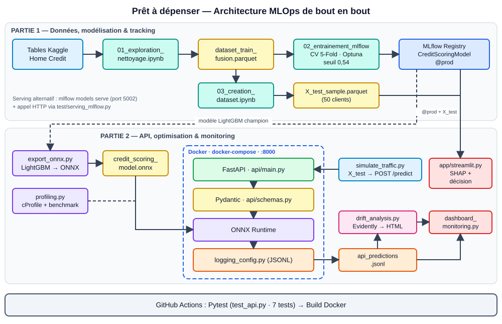
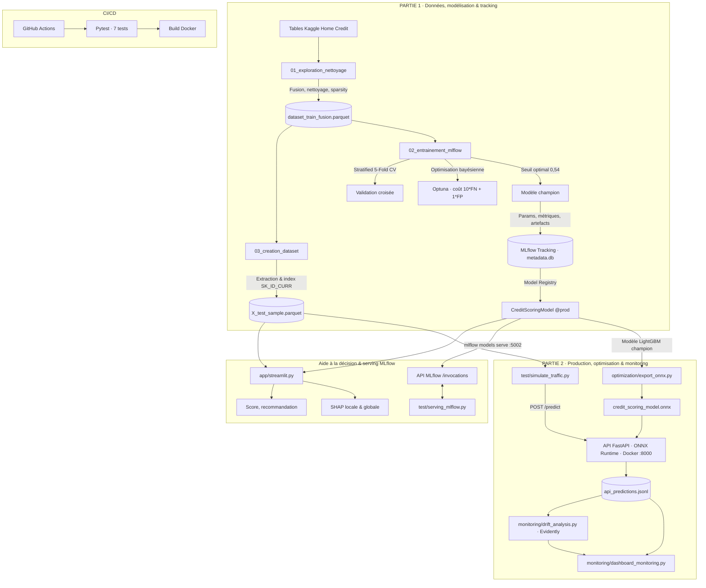
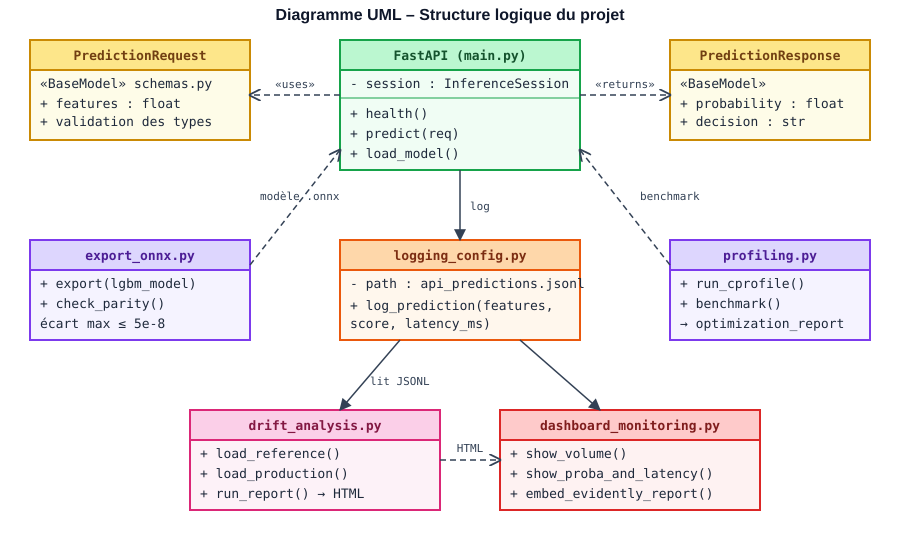
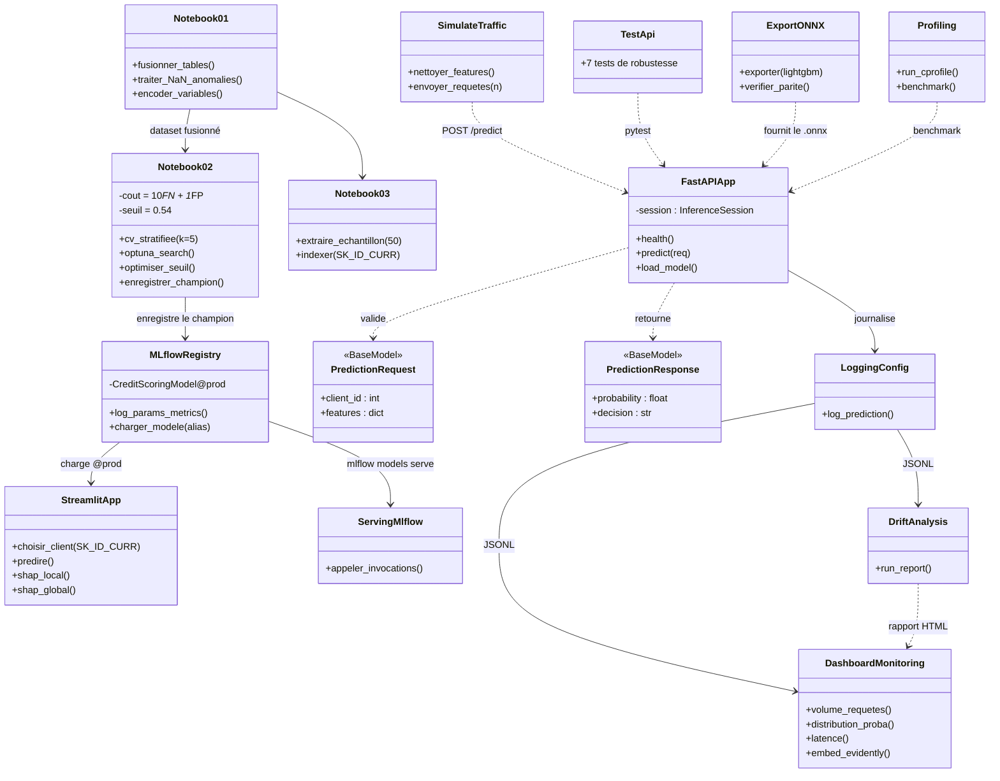
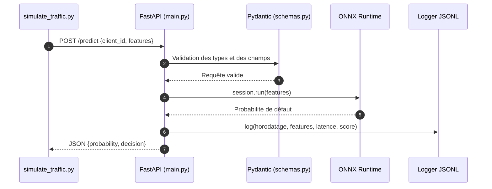
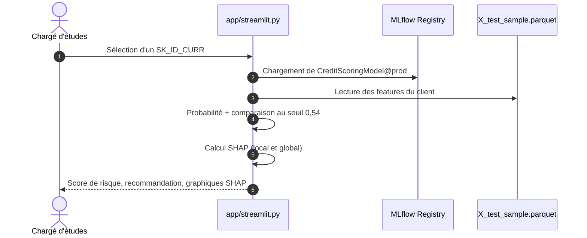

# Prêt à dépenser — Scoring Crédit & Plateforme MLOps

<p align="center">
  
</p>

<p align="center">
  
  
  
  
  
  
  
  
  
  
  
  
  
  
</p>

Ce projet met en place une chaîne MLOps de bout en bout pour la société financière « Prêt à dépenser ». Il prédit le risque de défaut de paiement d'un emprunteur, minimise une fonction de coût métier dissymétrique, assure la traçabilité des expérimentations dans MLflow, offre une interface d'aide à la décision explicable (SHAP) et met en production le modèle via une API conteneurisée, monitorée et optimisée pour le département « Crédit Express ».

| | Partie 1 — Modélisation & tracking | Partie 2 — Production & monitoring |
|---|---|---|
| **Objectif** | Entraîner, tracer et expliquer le modèle | Servir, monitorer et accélérer le modèle |
| **Livrables** | Notebooks, MLflow Registry, dashboard SHAP | API FastAPI, Docker, CI/CD, drift, ONNX |

---

## 📑 Sommaire

- [Architecture du système](#️-architecture-du-système)
- [Structure du projet](#-structure-du-projet)
- [Diagrammes UML](#-diagrammes-uml)
- [Installation & prérequis](#️-installation--prérequis)
- [Partie 1 — Modélisation, tracking & aide à la décision](#-partie-1--modélisation-tracking--aide-à-la-décision)
- [Partie 2 — API, Docker, monitoring & optimisation](#-partie-2--api-docker-monitoring--optimisation)
- [Tests & CI/CD](#-tests--cicd)

---

## 🏗️ Architecture du système

<p align="center">
  
</p>


```mermaid
flowchart TD
    subgraph P1 ["PARTIE 1 · Données, modélisation & tracking"]
        A[Tables Kaggle Home Credit] --> B["01_exploration_nettoyage"]
        B -->|Fusion, nettoyage, sparsity| C[("dataset_train_fusion.parquet")]
        C --> D["03_creation_dataset"]
        D -->|Extraction & index SK_ID_CURR| E[("X_test_sample.parquet")]
        C --> F["02_entrainement_mlflow"]
        F -->|Stratified 5-Fold CV| G["Validation croisée"]
        F -->|Optimisation bayésienne| H["Optuna · coût 10*FN + 1*FP"]
        F -->|Seuil optimal 0,54| I["Modèle champion"]
        I -->|Params, métriques, artefacts| J[("MLflow Tracking · metadata.db")]
        J -->|Model Registry| K["CreditScoringModel @prod"]
    end

    subgraph P1UX ["Aide à la décision & serving MLflow"]
        K --> N["app/streamlit.py"]
        E --> N
        N --> O["Score, recommandation"]
        N --> Q["SHAP locale & globale"]
        K -->|mlflow models serve :5002| L["API MLflow /invocations"]
        L <--> M["test/serving_mlflow.py"]
    end

    subgraph P2 ["PARTIE 2 · Production, optimisation & monitoring"]
        K -->|Modèle LightGBM champion| R["optimization/export_onnx.py"]
        R --> S["credit_scoring_model.onnx"]
        S --> T["API FastAPI · ONNX Runtime · Docker :8000"]
        E --> U["test/simulate_traffic.py"]
        U -->|POST /predict| T
        T --> V[("api_predictions.jsonl")]
        V --> W["monitoring/drift_analysis.py · Evidently"]
        V --> X["monitoring/dashboard_monitoring.py"]
        W --> X
    end

    subgraph CI ["CI/CD"]
        Y["GitHub Actions"] --> Z["Pytest · 7 tests"]
        Z --> AA["Build Docker"]
    end
```

---

## 📁 Structure du projet

```text
5_MLOps_Part2/
├── .github/workflows/
│   └── ci_cd.yml                       # Pipeline GitHub Actions (tests unitaires + build Docker)
├── api/
│   ├── main.py                         # API FastAPI (chargement unique, moteur ONNX)
│   ├── schemas.py                      # Schémas Pydantic (validation des inputs et types)
│   └── logging_config.py               # Logging structuré JSONL
├── app/
│   └── streamlit.py                    # Interface Streamlit d'aide à la décision et SHAP
├── data/
│   ├── mlflow/                         # Métadonnées SQLite (metadata.db) et artefacts MLflow
│   ├── processed/                      # Datasets nettoyés, échantillon de test, référence drift
│   │   ├── dataset_train_fusion.parquet
│   │   └── X_test_sample.parquet       # 50 clients indexés par SK_ID_CURR
│   ├── production/                     # Logs d'inférence temps réel (api_predictions.jsonl)
│   └── raw/                            # Données brutes Kaggle (application_train, bureau...)
├── docs/
│   ├── architecture.svg                # Schéma d'architecture MLOps
│   └── uml_classes.svg                 # Diagramme UML des modules
├── monitoring/
│   ├── drift_analysis.py               # Analyse du Data Drift (Evidently AI)
│   ├── dashboard_monitoring.py         # Dashboard Streamlit de suivi des métriques
│   └── reports/                        # Rapport HTML Evidently généré
├── notebooks/
│   ├── 01_exploration_nettoyage.ipynb  # EDA, encodage mixte, gestion des NaN et anomalies
│   ├── 02_entrainement_mlflow.ipynb    # Modélisation, 5-Fold CV, Optuna, seuil et logs
│   └── 03_creation_dataset.ipynb       # Génération de l'échantillon de test
├── optimization/
│   ├── export_onnx.py                  # Export LightGBM -> ONNX
│   ├── profiling.py                    # Profilage cProfile et benchmark
│   ├── credit_scoring_model.onnx       # Modèle sérialisé ONNX
│   └── optimization_report.txt         # Résultats comparatifs de latence
├── test/
│   ├── serving_mlflow.py               # Appel HTTP sur l'endpoint MLflow /invocations
│   ├── simulate_traffic.py             # Client de test : envoie 10 clients réels à /predict
│   └── test_api.py                     # Tests unitaires Pytest (7 tests de robustesse)
├── Dockerfile                          # Conteneurisation de l'API
├── docker-compose.yml                  # Déploiement local orchestré
└── pyproject.toml                      # Dépendances et environnement (uv)
```

---

## 🧩 Diagrammes UML

### Diagramme de classes / modules

<p align="center">
  
</p>

Version Mermaid (rendue nativement par GitHub) :


```mermaid
classDiagram
    class Notebook01 {
        +fusionner_tables()
        +traiter_NaN_anomalies()
        +encoder_variables()
    }
    class Notebook02 {
        -cout = 10*FN + 1*FP
        -seuil = 0.54
        +cv_stratifiee(k=5)
        +optuna_search()
        +optimiser_seuil()
        +enregistrer_champion()
    }
    class Notebook03 {
        +extraire_echantillon(50)
        +indexer(SK_ID_CURR)
    }
    class MLflowRegistry {
        -CreditScoringModel@prod
        +log_params_metrics()
        +charger_modele(alias)
    }
    class StreamlitApp {
        +choisir_client(SK_ID_CURR)
        +predire()
        +shap_local()
        +shap_global()
    }
    class ServingMlflow {
        +appeler_invocations()
    }
    class SimulateTraffic {
        +nettoyer_features()
        +envoyer_requetes(n)
    }
    class TestApi {
        +7 tests de robustesse
    }
    class PredictionRequest {
        <<BaseModel>>
        +client_id : int
        +features : dict
    }
    class PredictionResponse {
        <<BaseModel>>
        +probability : float
        +decision : str
    }
    class FastAPIApp {
        -session : InferenceSession
        +health()
        +predict(req)
        +load_model()
    }
    class LoggingConfig {
        +log_prediction()
    }
    class ExportONNX {
        +exporter(lightgbm)
        +verifier_parite()
    }
    class Profiling {
        +run_cprofile()
        +benchmark()
    }
    class DriftAnalysis {
        +run_report()
    }
    class DashboardMonitoring {
        +volume_requetes()
        +distribution_proba()
        +latence()
        +embed_evidently()
    }

    Notebook01 --> Notebook02 : dataset fusionné
    Notebook01 --> Notebook03
    Notebook02 --> MLflowRegistry : enregistre le champion
    MLflowRegistry --> StreamlitApp : charge @prod
    MLflowRegistry --> ServingMlflow : mlflow models serve
    SimulateTraffic ..> FastAPIApp : POST /predict
    TestApi ..> FastAPIApp : pytest
    ExportONNX ..> FastAPIApp : fournit le .onnx
    Profiling ..> FastAPIApp : benchmark
    FastAPIApp ..> PredictionRequest : valide
    FastAPIApp ..> PredictionResponse : retourne
    FastAPIApp --> LoggingConfig : journalise
    LoggingConfig --> DriftAnalysis : JSONL
    LoggingConfig --> DashboardMonitoring : JSONL
    DriftAnalysis ..> DashboardMonitoring : rapport HTML
```

### Séquence — appel à `/predict`


```mermaid
sequenceDiagram
    autonumber
    participant C as simulate_traffic.py
    participant A as FastAPI (main.py)
    participant S as Pydantic (schemas.py)
    participant O as ONNX Runtime
    participant L as Logger JSONL

    C->>A: POST /predict {client_id, features}
    A->>S: Validation des types et des champs
    S-->>A: Requête valide
    A->>O: session.run(features)
    O-->>A: Probabilité de défaut
    A->>L: log(horodatage, features, latence, score)
    A-->>C: JSON {probability, decision}
```

### Séquence — décision assistée dans Streamlit


```mermaid
sequenceDiagram
    autonumber
    actor E as Chargé d'études
    participant U as app/streamlit.py
    participant R as MLflow Registry
    participant D as X_test_sample.parquet

    E->>U: Sélection d'un SK_ID_CURR
    U->>R: Chargement de CreditScoringModel@prod
    U->>D: Lecture des features du client
    U->>U: Probabilité + comparaison au seuil 0,54
    U->>U: Calcul SHAP (local et global)
    U-->>E: Score de risque, recommandation, graphiques SHAP
```

---

## ⚙️ Installation & prérequis

Le projet s'exécute avec Python 3.11 et utilise le gestionnaire d'environnement `uv`.

```bash
# Cloner le dépôt
git clone <URL_DU_DEPOT>
cd 5_MLOps_Part2

# Installer et synchroniser l'environnement virtuel
uv sync
```

---

## 🧠 Partie 1 — Modélisation, tracking & aide à la décision

### 1. Pipeline de données et de modélisation

Exécutez séquentiellement les notebooks dans Jupyter :

| Notebook | Rôle |
|---|---|
| `notebooks/01_exploration_nettoyage.ipynb` | Ingestion, fusion des tables Kaggle, traitement des valeurs manquantes et aberrantes, encodage mixte |
| `notebooks/02_entrainement_mlflow.ipynb` | Validation croisée stratifiée (5 folds), optimisation des hyperparamètres (Optuna), optimisation du seuil et enregistrement du champion |
| `notebooks/03_creation_dataset.ipynb` | Création de `X_test_sample.parquet` (50 clients indexés par `SK_ID_CURR`) pour l'inférence |

**Fonction de coût métier :** `10 × FN + 1 × FP` (un défaut non détecté coûte dix fois plus qu'un bon client refusé). Le seuil de décision optimal obtenu est **0,54**.

### 2. Interface web MLflow (visualisation du tracking)

Pour visualiser les runs, comparer les courbes d'apprentissage et vérifier le registre de modèles :

```bash
uv run mlflow ui --backend-store-uri sqlite:///data/mlflow/metadata.db --port 5000 --host 127.0.0.1 --workers 1
```

Accès : http://127.0.0.1:5000

### 3. Serving MLflow (alternative)

MLflow sert directement le modèle champion enregistré sous l'alias `prod` :

```bash
# Serveur d'inférence sur le port 5002
uv run mlflow models serve -m "models:/CreditScoringModel@prod" -p 5002 --no-conda
```

Dans un autre terminal, pour tester l'endpoint `/invocations` :

```bash
uv run python test/serving_mlflow.py
```

### 4. Tableau de bord d'aide à la décision (Streamlit)

```bash
uv run streamlit run app/streamlit.py
```

Accès : http://localhost:8501

**Fonctionnalités de l'interface :**

- **Saisie client** : sélection par identifiant bancaire réel (`SK_ID_CURR`).
- **Décision automatisée** : calcul de probabilité et arbitrage selon le seuil métier optimal (0,54).
- **Interprétabilité locale (SHAP)** : graphique en cascade (waterfall) des contributions positives et négatives des variables pour le client sélectionné.
- **Interprétabilité globale** : classement des 20 variables les plus influentes sur les décisions du modèle.

---

## 🚀 Partie 2 — API, Docker, monitoring & optimisation

### 1. Démarrer l'API FastAPI

```bash
uv run uvicorn api.main:app --reload --port 8000
```

- Documentation Swagger interactive : http://127.0.0.1:8000/docs
- Healthcheck : http://127.0.0.1:8000/health

### 2. Simuler du trafic

Le script `test/simulate_traffic.py` rejoue des clients réels contre l'API en cours d'exécution :

1. Charge les 10 premières lignes de `X_test_sample.parquet` (`data/processed/`, avec repli sur `../5_MLOps_Part1/data/processed/`).
2. Nettoie chaque ligne : `TARGET` et `SK_ID_CURR` sont exclus des features, les `NaN` deviennent `None`, les types NumPy sont convertis en types Python natifs.
3. Envoie un `POST /predict` avec le payload `{"client_id": ..., "features": {...}}`.
4. Affiche pour chaque client le code HTTP, la probabilité de défaut et la décision.

```bash
uv run python test/simulate_traffic.py
```

Ce script alimente aussi `data/production/api_predictions.jsonl`, donc le dashboard de monitoring et l'analyse de drift.

### 3. Déploiement conteneurisé (Docker)

L'API est entièrement conteneurisée avec prise en charge d'OpenMP (`libgomp1`) pour l'inférence :

```bash
# Construction et lancement du conteneur
docker compose up -d --build

# Consultation des logs
docker compose logs -f scoring_api
```

### 4. Monitoring & détection de Data Drift

1. **Logging structuré** : chaque requête reçue par `/predict` est enregistrée dans `data/production/api_predictions.jsonl` avec l'horodatage, les features, la latence et le score prédit.

2. **Analyse de dérive (Evidently AI)** :

   ```bash
   uv run python monitoring/drift_analysis.py
   ```

   Génère le rapport HTML interactif comparant la production au jeu de référence.

3. **Tableau de bord de suivi** :

   ```bash
   uv run streamlit run monitoring/dashboard_monitoring.py --server.port 8502
   ```

   Visualisation du volume de requêtes, de la distribution des probabilités, de la latence d'inférence et du rapport Evidently embarqué. Le port 8502 évite le conflit avec le dashboard d'aide à la décision (8501).

### 5. Profilage & optimisation (ONNX Runtime)

Pour satisfaire les exigences temps réel de « Crédit Express », le modèle a été converti au format ONNX et exécuté via ONNX Runtime :

| Indicateur | LightGBM | ONNX Runtime | Gain |
|---|---|---|---|
| Latence moyenne | 10,69 ms | 0,03 ms | **x390,5** (−99,7 % du temps d'inférence) |
| Non-régression (écart absolu max des probabilités) | — | ≤ 5 × 10⁻⁸ | Résultats équivalents |

> Le ratio x390,5 est calculé sur les mesures non arrondies ; les latences ci-dessus sont arrondies pour la lisibilité.

```bash
uv run python optimization/export_onnx.py
uv run python optimization/profiling.py
```

Les résultats détaillés sont dans `optimization/optimization_report.txt`.

---

## ✅ Tests & CI/CD

```bash
uv run python -m pytest
```

`test/test_api.py` regroupe 7 tests de robustesse de l'API. Le workflow `.github/workflows/ci_cd.yml` exécute ces tests puis construit l'image Docker à chaque push ou pull request.

| Ports | Service |
|---|---|
| 5000 | MLflow UI |
| 5002 | Serving MLflow (`/invocations`) |
| 8000 | API FastAPI (`/predict`, `/health`, `/docs`) |
| 8501 | Dashboard d'aide à la décision (SHAP) |
| 8502 | Dashboard de monitoring |